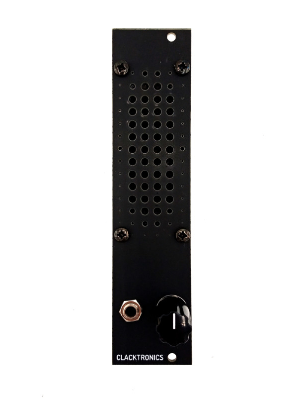

# Clacktronics Mini-Speaker Kit

This project is a simple audio monitor module for your Eurorack. It consists of a speaker driver mounted onto an FR4 panel with an amplifier board. Much like the EDP Wasp or the Arp 2600, It will not be the most high definition speaker, especially lacking at the low end, but it is handy for when you may not be able to access your monitors or if you are using a small portable system.

As a kit it is designed to be simple and fast to assemble, so ideal for beginners. There are only a handful of components to solder so should give fast gratification and troubleshooting should be simple. The speaker is exactly 30.5mm wide which means it just fits into the 6HP (30mm) panel width.

* Width: 6HP
* Height: 3U
* Depth: 50mm
* Current draw idle: 5mA(+12V) 0mA(-12V) 0mA(5V)
* Current draw Active: 80mA(+12V) 0mA(-12V) 0mA(5V) (driven with 10Vpp square wave at 500kHz)

More information at [clacktronics.co.uk/euroclack](clacktronics.co.uk/euroclack)
